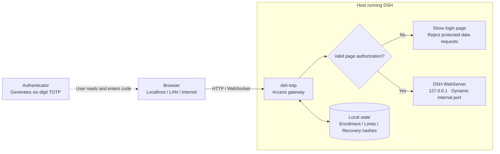

# dsh-totp

**An access-verification step for DeepSeek Harness, under your control.**

[简体中文](README.md) · **English**


Enter the **six-digit code** from your authenticator before accessing your DSH workspace. The plugin supports standard TOTP apps such as Google Authenticator and Microsoft Authenticator. Enrollment, protection controls, recovery codes, and locking are all handled inside DSH.

Built for people who want access control for a personal DSH Web instance, especially when accessing it over a LAN or remotely. TOTP is the sign-in credential: no Google / Microsoft account sign-in or separate login service is required.

**Compatibility target: DSH `0.1.2-rc.1` · Node.js `24+` · MIT License**

[Quick start](#quick-start) · [Everyday use](#everyday-use) · [How it works](#how-it-works) · [Security boundaries](#security-boundaries)

## Why use it?

| What you need | What dsh-totp provides |
| --- | --- |
| Knowing the URL should not grant access | With protection enabled, localhost, LAN, and public access through the gateway require a code |
| No extra account system or login site to maintain | QR enrollment inside DSH Settings |
| Control over when verification is required | Protection starts off on a fresh installation, turns on after enrollment, and can be toggled later |
| An immediate way to revoke access when stepping away | Lock all authorized pages and devices with one click, without another code |
| A way back after losing access to a phone | Single-use recovery codes and an authenticator replacement flow |
| No second login immediately after enrollment | The enrolling page stays usable; save the recovery codes and continue |

## Quick start

The plugin's UI labels are currently Chinese. English descriptions below include the key Chinese labels where needed.

### 1. Add the plugin

Once the package is published to your npm registry, install it by name:

```sh
dsh plugin --profile web add dsh-totp
```

> This source version is not yet published to the public npm registry. If installation by name reports that the package cannot be found, use the local installation below.

Run these commands from this repository's directory:

```sh
npm install
dsh plugin --profile web add "$PWD"
```

Plugins are installed per profile. These commands target `web`; replace it with your profile name if you use another Web profile.

### 2. Start DSH

If the Web instance is already running, stop it and start it again once to load the plugin configuration:

```sh
dsh --profile web --no-open
```

Open the address printed after `dsh-totp HTTP entry` in the terminal.

**Protection is off on a fresh installation.** Enter DSH first, then enroll your authenticator. Upgrades, reinstalls, and ordinary restarts preserve the existing enrollment and protection setting rather than resetting them to the defaults.

### 3. Enroll an authenticator

1. Open **Settings → Access Verification** (`设置 → 访问验证`) and select **Bind authenticator** (`绑定验证器`).
2. Add an account in Google Authenticator or Microsoft Authenticator and scan the QR code.
3. Enter the new authenticator's current **six-digit code**, then select **Confirm enrollment and enable protection** (`确认绑定并开启保护`).
4. Save the **10 single-use recovery codes** and select **Saved, continue using DSH** (`已保存，继续使用 DSH`).

Protection turns on immediately after confirmation. **The enrolling page stays usable and returns directly to Settings. No second login or wait for the next code is required.** Existing authorization on other open pages is revoked.

Generating a QR code or canceling enrollment does not enable protection. Enrollment and replacement are performed in the browser; there is no CLI enrollment command.

## Everyday use

| Action | How | Result |
| --- | --- | --- |
| Enter DSH | With protection on, open or refresh the page and enter a code | A temporary authorization is issued for that page |
| Enable / disable protection | Use the Settings control and confirm with a fresh code | Takes effect immediately and revokes old page authorization; access is direct when protection is off |
| Lock all devices | Select **Lock** (`锁定`) on the conversation page, or **Lock all devices** (`锁定所有设备`) in Settings | Locks the current page and all other authorized pages without another code |
| Regenerate recovery codes | Select **Update recovery codes** (`更新恢复码`) and enter a fresh code | Issues 10 new codes and invalidates the old set |
| Replace an authenticator | Verify a current code, then scan a new QR code and confirm the new code | Activates the new authenticator; the current page stays usable and other pages must verify again |

**Lock button states:**

- No authenticator enrolled: disabled, with a prompt to enroll in Settings.
- Enrolled, protection off: disabled, with a prompt to enable protection in Settings.
- Enrolled, protection on: ready to lock immediately, without another verification step.

Locking closes access connections. The plugin does not explicitly cancel DSH background tasks; their behavior after disconnection depends on DSH and the plugins running those tasks.

### When your phone is unavailable

Select **Cannot use authenticator** (`无法使用验证器`) on the login page, enter an unused recovery code, and enroll a new authenticator.

A successful recovery-code check immediately revokes the old authenticator and old page authorization. Until the new authenticator is confirmed, the recovery capability permits enrollment only, not access to DSH data. Confirm the new TOTP, save the new recovery codes, and enter DSH directly without another login.

Each recovery code can be used once. Replace your saved backup whenever you regenerate codes or complete a new enrollment.

## How it works

The plugin places a single access gateway in front of DSH's Web server and makes authorization decisions on the server. This diagram shows the request path **with protection enabled**:



- **One entry point.** The plugin replaces the original listener configuration. Its gateway handles external access, while the internal DSH WebServer is bound to loopback.
- **One process and one access address.** The plugin runs inside DSH. Enrollment and management use the same external port; no separate enrollment service is started.
- **Server-enforced authorization.** Pages carry temporary credentials for API and WebSocket access. A hidden button or login screen is not the security boundary.
- **Native credentials stay on the server.** The gateway completes DSH's native authentication and proxies requests without sending those native tokens or cookies to the browser.
- **Enrollment continues the current session.** Confirming the new TOTP updates authorization for the enrolling page and revokes authorization for other pages.

When protection is off, the gateway permits direct access to DSH. The toggle controls actual access, not just the appearance of the login page.

## LAN and remote access

Allow other devices to connect using the host's IP address:

```sh
dsh --profile web --host 0.0.0.0 --port 3080 --no-open
```

For a domain, public address, or port mapping, also declare the `host:port` that browsers will use. For example:

```sh
dsh --profile web --host 0.0.0.0 --port 3080 --no-open \
  --trusted-host dsh.example.com:3080
```

Replace the example domain. `--trusted-host` checks the request's destination **Host**, not the client's source IP. It does not configure DNS, firewall rules, or router port forwarding. Local IPv4 interface addresses are added automatically to the allowed access addresses.

With protection enabled, localhost, LAN IPs, and public access through the gateway follow the same TOTP rules.

## Verification rules

| Item | Current behavior |
| --- | --- |
| Codes | Standard TOTP: HMAC-SHA-1, six digits, 30-second period, ±1-step time tolerance |
| Replay protection | A time step is accepted only once per authenticator; consumption records survive restarts |
| Per-source failure limit | Up to 5 failures per 5-minute window, per source IP as seen by the server |
| Global failure limit | Up to 10 failures per 1-minute window across all sources |
| Page authorization | Expires after 15 minutes without user activity, with an 8-hour maximum lifetime by default |
| Enrollment flow | Valid for 5 minutes |
| Recovery codes | 10 single-use codes; regeneration or successful re-enrollment invalidates the previous set |

Login, recovery, and TOTP-protected management operations share the failure allowance. Successful checks, formatting errors, and replayed codes do not consume it. A successful check does not erase previous failures. The UI displays a countdown when a limit is reached.

**What if a code has already been used?** An already authorized DSH page remains usable. Wait for the next code when entering another page or performing another operation that requires one. Completing enrollment does not require that wait.

## Security boundaries

**HTTP support does not provide transport encryption.** With HTTP, an attacker on the network path may capture or modify QR codes, TOTPs, page credentials, and DSH data. TOTP access control does not replace HTTPS or another protected transport, and is not phishing-resistant.

Use the plugin within these boundaries:

- It provides TOTP access verification for a personal instance, not multiple user accounts, roles, or password-plus-TOTP two-factor authentication.
- With protection off, anyone who can reach the address can enter DSH and use the file, command, and other capabilities available in that instance.
- TOTP seeds are encrypted locally with AES-256-GCM and a separately stored master key. This does not defend against an attacker with host access who can read both the database and that key.
- The internal loopback listener reduces network exposure but does not isolate local processes. The plugin is not a workspace isolation layer or an execution sandbox.
- Current integration covers DSH Fetch, XHR, `/api/` WebSockets, and scoped resource requests. Custom connection paths used by third-party plugins may need additional integration.
- Corrupt state, a missing key, or database failures deny access. Uninstalling the plugin removes this access-control layer; it is not equivalent to disabling protection in Settings.

## Configuration and local administration

<details>
<summary>Expand for configuration, data directories, and local commands</summary>

### Optional configuration

Configure the plugin in the relevant profile's `cordis.patch.yml`:

```yaml
- id: dsh-totp
  config:
    host: '0.0.0.0'
    port: 3080
    allowedHosts:
      - 'dsh.example.com:3080'
    idleMs: 900000
    maxMs: 28800000
```

Listener, port, and data-directory changes require a restart. In-page protection toggles and locking take effect immediately.

### Data directory

The default resolves from `DSH_TOTP_DATA_DIR`, then `$DSH_HOME/dsh-totp`, then `~/.dsh/dsh-totp`. The plugin's `dataDir` configuration can override that default.

Only one running plugin instance may use a data directory. Use separate directories for separate DSH instances. Ordinary restarts preserve enrollment and the protection setting, but not page authorization.

### Local commands

Run from this repository's directory:

```sh
node src/cli.js status
node src/cli.js doctor
node src/cli.js enable
node src/cli.js disable
node src/cli.js lock
```

These are recovery and administration tools for someone with local management privileges; they do not require a phone code. The `lock` command enables protection and locks all pages, unlike the Web button that is disabled while protection is off. Protection cannot be enabled without an enrolled authenticator.

Add `--data-dir /path/to/data` when needed. The CLI and plugin must use the same data directory. These commands do not enroll or replace authenticators.

</details>

## Check and package from source

```sh
npm install
npm run check
npm pack --dry-run
npm pack
```

`check` validates JavaScript syntax only. `pack --dry-run` previews the published file list. `pack` checks syntax before creating the archive. The package includes runtime source, plugin configuration, both READMEs, the cover, and the license; local dependencies and test data are excluded.

The cover is a conceptual illustration. The architecture diagram describes this repository's implementation. After upgrading DSH, verify enrollment, login, protection controls, and locking in your target environment.

## Release to GitHub

Commit your code changes first so the working tree is clean. Configure your Git identity and push access to `origin`, then run:

```sh
npm run release
```

Each run increments the patch version (for example, `0.1.0` → `0.1.1`) in `package.json`, `dsh.plugin.json`, and `package-lock.json`. After the syntax check passes, it creates a `chore(release): v0.1.1` commit and an annotated `v0.1.1` tag, then **pushes the current branch and that tag together to `origin`**, including any earlier local commits on the branch.

The script stops for uncommitted changes, a remote branch that is ahead or diverged, inconsistent versions, or a conflicting target tag. The push is atomic: both refs succeed or neither does. If the release commit or tag exists but the push fails, fix the error and rerun the command to resume without another version bump.

Preview the next release (reads the remote and runs checks without changing versions, creating commits or tags, or pushing):

```sh
npm run release -- --dry-run
```

This command publishes Git refs only; it does not run `npm publish` or create a GitHub Release page. Run `npm run test:release` for the release script's local Git integration tests.

## License

[MIT](LICENSE)
