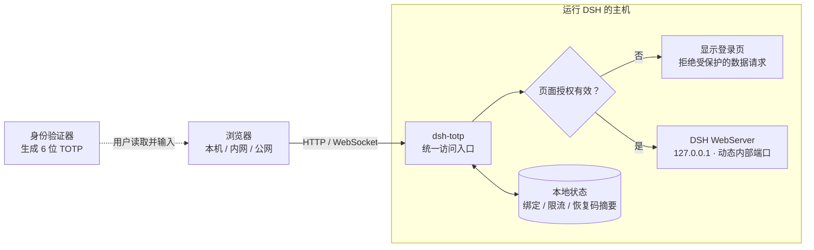

# dsh-totp

**为 DeepSeek Harness 加一道由你掌控的访问验证。**

**简体中文** · [English](README.en.md)


在 DSH 入口输入身份验证器里的 **6 位动态码**，再进入你的工作区。支持 Google Authenticator、Microsoft Authenticator 等标准 TOTP 应用，绑定、保护开关、恢复码和锁定都在 DSH 内完成。

适合希望给个人 DSH Web 实例增加访问控制的用户，尤其是在局域网或远程访问场景中。它使用 TOTP 作为登录凭据，不依赖 Google / Microsoft 账号登录，也不需要额外搭建登录服务。

**兼容目标：DSH `0.1.2-rc.1` · Node.js `24+` · MIT License**

[快速开始](#快速开始) · [日常使用](#日常使用) · [工作原理](#工作原理) · [安全边界](#安全边界)

## 为什么使用它

| 你想解决的问题 | dsh-totp 提供的能力 |
| --- | --- |
| 不希望别人知道地址就能进入 DSH | 开启保护后，本机、内网和公网访问同一入口都需要动态码 |
| 不想维护另一套账号或登录站点 | 在 DSH 的「设置 → 访问验证」中扫码绑定 |
| 希望自己决定什么时候启用验证 | 首次安装默认关闭，绑定成功后开启，之后可随时切换 |
| 暂时离开时希望立即收回访问权限 | 一键锁定所有已授权页面和设备，无需再输入动态码 |
| 担心换手机后无法访问 | 提供一次性恢复码和验证器更换流程 |
| 不希望绑定完成后再等一轮验证码 | 当前绑定页保持可用，保存恢复码后直接继续使用 |

## 快速开始

### 1. 添加插件

发布到你使用的 npm registry 后，可以通过包名安装：

```sh
dsh plugin --profile web add dsh-totp
```

> 当前源码版本尚未发布到公共 npm registry。如果通过包名安装提示找不到包，请使用下面的本地安装方式。

在本仓库目录执行：

```sh
npm install
dsh plugin --profile web add "$PWD"
```

插件按 profile 安装。上述命令添加到 `web`；如果使用其他 Web profile，请将 `web` 替换成相应名称。

### 2. 启动 DSH

如果 Web 实例已经运行，先停止它，再启动一次，让插件配置生效：

```sh
dsh --profile web --no-open
```

打开终端中 `dsh-totp HTTP entry` 打印的地址。

**首次安装时，访问保护默认关闭。** 你可以直接进入 DSH，再自行绑定验证器。升级、重装或普通重启会保留已有绑定和保护开关，不会把它们重置成默认值。

### 3. 扫码绑定

1. 打开 DSH 的 **设置 → 访问验证**，点击 **绑定验证器**。
2. 在 Google Authenticator 或 Microsoft Authenticator 中添加账号，扫描页面上的二维码。
3. 输入新验证器当前显示的 **6 位动态码**，点击 **确认绑定并开启保护**。
4. 保存页面给出的 **10 个一次性恢复码**，点击 **已保存，继续使用 DSH**。

绑定成功后，保护立即开启。**当前绑定页面继续可用，直接回到设置页，无需再次登录或等待动态码刷新。** 其他已打开页面的旧授权会失效。

仅生成二维码或取消绑定，不会开启保护。绑定和换绑均在网页中完成，不提供 CLI 绑定命令。

## 日常使用

| 操作 | 如何操作 | 结果 |
| --- | --- | --- |
| 进入 DSH | 保护开启时，打开或刷新页面并输入动态码 | 获得当前页面的临时访问授权 |
| 开启 / 关闭保护 | 在设置页点击开关，输入一组新的动态码确认 | 立即生效，旧页面授权撤销；关闭后可直接访问 |
| 锁定所有设备 | 点击对话页右下角的「锁定」，或设置页的「锁定所有设备」 | 当前页和其他已授权页面立即锁定，无需动态码 |
| 更新恢复码 | 在设置页点击「更新恢复码」，输入新的动态码 | 生成 10 个新恢复码，旧恢复码失效 |
| 更换验证器 | 验证当前动态码，再扫描新二维码并确认新动态码 | 新验证器生效；当前页面可继续使用，其他页面重新验证 |

**锁定按钮的状态：**

- 未绑定验证器：置灰，提示先到设置页绑定。
- 已绑定但保护关闭：置灰，提示先到设置页开启保护。
- 已绑定且保护开启：可直接锁定，无需再次验证。

锁定会关闭访问连接，插件不会主动取消 DSH 后台任务。具体任务在连接中断后的行为仍由 DSH 和所用插件决定。

### 手机不可用时

在登录页点击 **无法使用验证器**，输入一个未使用过的恢复码，然后重新绑定验证器。

恢复码验证成功后，旧验证器和旧页面授权立即失效。在新验证器确认前，恢复授权仅允许绑定，不能访问 DSH 数据。确认新动态码并保存新恢复码后，可以直接进入 DSH，无需再登录一次。

每个恢复码只能使用一次。更新恢复码或成功换绑后，请用新的恢复码替换旧备份。

## 工作原理

插件在 DSH 的 Web 服务前增加一个统一访问入口，在服务端判断是否允许访问。下图描述的是**访问保护开启时**的请求路径：



- **入口统一。** 插件替换原有 WebServer 的监听配置，由受保护的入口对外提供访问，内部 DSH WebServer 限定在回环地址。
- **同一进程、同一访问地址。** 插件运行在 DSH 进程内，扫码和管理使用同一个对外端口，不启动独立绑定服务。
- **授权落实在服务端。** 页面携带临时凭据访问 API 和 WebSocket；隐藏按钮或登录界面本身不是安全边界。
- **原生凭据留在服务端。** 网关完成 DSH 原生认证，再代理请求；不会将这组原生 token / Cookie 下发给浏览器。
- **绑定与登录衔接。** 新动态码确认成功后，当前绑定页面的授权更新到新状态；其他页面的授权被撤销。

保护关闭时，入口允许直接进入 DSH。这个开关控制的是实际访问权限。

## 内网与远程访问

允许其他设备通过本机 IP 访问：

```sh
dsh --profile web --host 0.0.0.0 --port 3080 --no-open
```

使用域名、公网地址或端口映射时，额外声明浏览器访问的 `host:port`。例如：

```sh
dsh --profile web --host 0.0.0.0 --port 3080 --no-open \
  --trusted-host dsh.example.com:3080
```

请替换示例域名。`--trusted-host` 检查的是请求访问的 **Host**，不是来源 IP 白名单，也不会自动配置 DNS、防火墙或路由器端口映射。本机 IPv4 网卡地址会自动加入允许的访问地址。

开启保护后，localhost、内网 IP 和公网入口遵循相同的动态码验证规则。

## 验证规则

| 项目 | 当前行为 |
| --- | --- |
| 动态码 | 标准 TOTP，HMAC-SHA-1，6 位，每 30 秒更新，时间容差 ±1 步 |
| 防重放 | 同一验证器时间步只接受一次，消费记录持久化，重启后仍有效 |
| 单来源失败限制 | 服务端看到的每个来源 IP，5 分钟窗口最多 5 次失败 |
| 全局失败限制 | 所有来源合计，1 分钟窗口最多 10 次失败 |
| 页面授权 | 默认无用户操作 15 分钟到期，最长 8 小时 |
| 绑定流程 | 5 分钟内有效 |
| 恢复码 | 10 个一次性恢复码；更新或重新绑定后旧码失效 |

登录、恢复和涉及动态码的管理操作共用失败额度。成功验证、格式错误和已使用码不计入失败次数；成功验证也不会抹去此前的失败记录。达到限制后，页面会显示等待倒计时。

**出现「此动态码已使用」怎么办？** 已验证的 DSH 页面可继续使用；若要进入另一个页面，或执行另一个需要动态码的操作，等待验证器刷新后再输入。无需为了结束绑定流程等待新码。

## 安全边界

**支持 HTTP，不代表提供链路加密。** HTTP 下的二维码、动态码、页面凭据和 DSH 数据可能被链路上的攻击者窃取或篡改。TOTP 访问控制无法替代 HTTPS 或其他受保护的传输通道，也不提供防钓鱼能力。

此外，请按以下能力范围使用：

- 这是面向个人实例的 TOTP 访问验证，不是多用户账号、角色权限或“密码 + TOTP”双因素系统。
- 保护关闭时，能访问地址的人可进入 DSH，并使用该实例开放的文件、命令等能力。
- TOTP 种子在本地使用 AES-256-GCM 加密，主密钥单独保存；这无法防御已取得主机权限、能够同时读取数据库和主密钥的攻击者。
- 内部回环监听减少网络暴露，不隔离同一主机上的本地进程。插件不提供工作区隔离或执行沙箱。
- 目前适配 DSH 的 Fetch、XHR、`/api/` WebSocket 和受限资源请求；第三方插件自建连接路径可能需要额外适配。
- 状态损坏、密钥缺失或数据库故障时拒绝访问。卸载插件会移除这层访问控制，不等同于在设置页关闭保护。

## 配置与本机管理

<details>
<summary>展开查看配置、数据目录和本机命令</summary>

### 可选配置

可在对应 profile 的 `cordis.patch.yml` 中配置：

```yaml
- id: dsh-totp
  config:
    host: '0.0.0.0'
    port: 3080
    allowedHosts:
      - 'dsh.example.com:3080'
    idleMs: 900000
    maxMs: 28800000
```

修改监听地址、端口或数据目录需要重启；页面内的保护启停和锁定立即生效。

### 数据目录

默认依次使用 `DSH_TOTP_DATA_DIR`、`$DSH_HOME/dsh-totp`、`~/.dsh/dsh-totp`。插件配置的 `dataDir` 可覆盖默认路径。

每个数据目录只允许一个运行中的插件实例。多个 DSH 实例应使用不同目录。普通重启保留绑定和保护状态，但不保留页面授权。

### 本机命令

在本仓库目录执行：

```sh
node src/cli.js status
node src/cli.js doctor
node src/cli.js enable
node src/cli.js disable
node src/cli.js lock
```

这些是持有本机管理权限的恢复与运维入口，不要求手机动态码。`lock` 命令会开启保护并锁定所有页面，因此与保护关闭时置灰的网页按钮不同；未绑定时不能开启保护。

可附加 `--data-dir /path/to/data`。本机命令必须与插件使用同一数据目录。它们不支持扫码绑定或换绑。

</details>

## 从源码检查与打包

```sh
npm install
npm run check
npm pack --dry-run
npm pack
```

`check` 仅检查 JavaScript 语法；`pack --dry-run` 预览发布清单；`pack` 先检查语法再生成安装包。发布内容包含运行源码、插件配置、两种语言的 README、封面和许可证，不包含本地依赖或测试数据。

封面是概念插画，架构图以本仓库实现为准。DSH 升级后，请在目标环境复核绑定、登录、保护开关和锁定流程。

## 发布到 GitHub

先提交当前代码修改，确保工作区干净，并配置好 Git 提交身份和 `origin` 的推送权限，然后执行：

```sh
npm run release
```

每次自动将补丁版本加 1（如 `0.1.0` → `0.1.1`），同步更新 `package.json`、`dsh.plugin.json` 和 `package-lock.json`。语法检查通过后，创建 `chore(release): v0.1.1` 提交和带注释的 `v0.1.1` tag，再将**当前分支及该 tag 一起推送到 `origin`**；当前分支已有的本地提交也会一起推送。

工作区有未提交修改、远端分支领先或分叉、版本不一致、目标 tag 冲突时会停止。推送采用原子操作，分支和 tag 一起成功或一起失败；若提交或 tag 已生成但推送失败，处理错误后重新运行同一命令即可续推，不会重复增加版本。

预览下一次发布（会读取远端并运行检查，但不修改版本、创建提交、tag 或推送）：

```sh
npm run release -- --dry-run
```

此命令仅发布 Git 分支和 tag，不执行 `npm publish`，也不创建 GitHub Release 页面。发布脚本的本地 Git 集成测试可通过 `npm run test:release` 运行。

## 许可证

[MIT](LICENSE)
